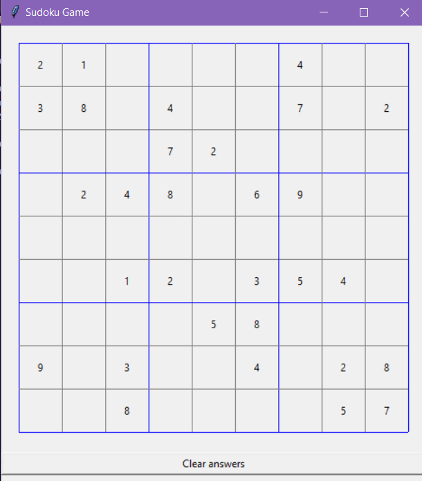

# Sudoku Game and Solver (Python, tkinter)
### Above is the code I used for this project, both the Solver and interactive game code is shown. Below is a description of my project.
- One can run both of the programs by going into the command line and typing "SudokuGame.py --board n00b" or "SudokuSolver.py --board n00b" where n00b is a .sudoku file included above
- Created a sudoku game that allows the user to play by interacting with a graphical user interface
- Designed a sudoku solver using a backtracking algorithm to solve newly generated games
- Below is a screenshot of the game with a clear board
  

.png)

